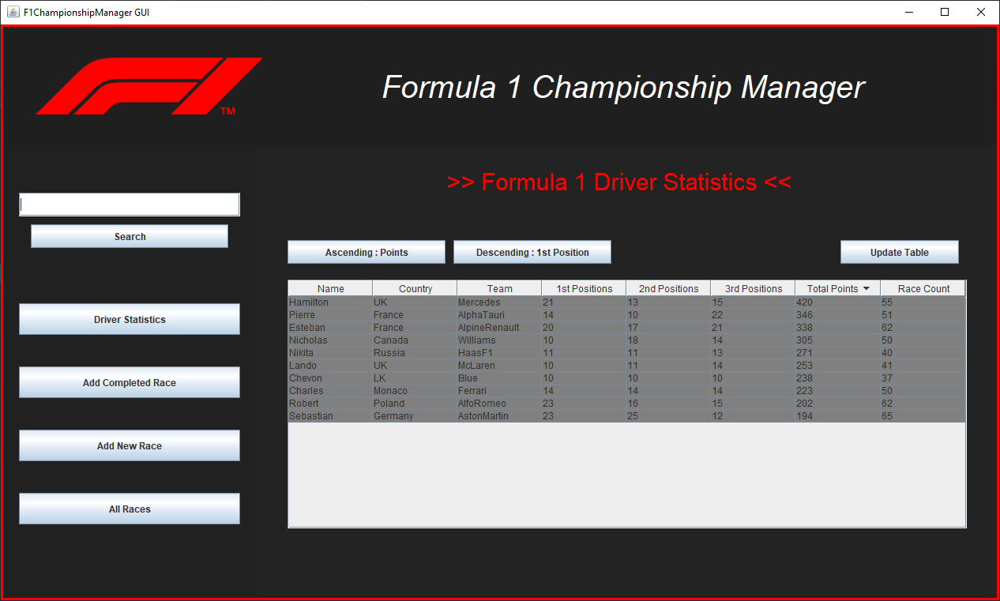
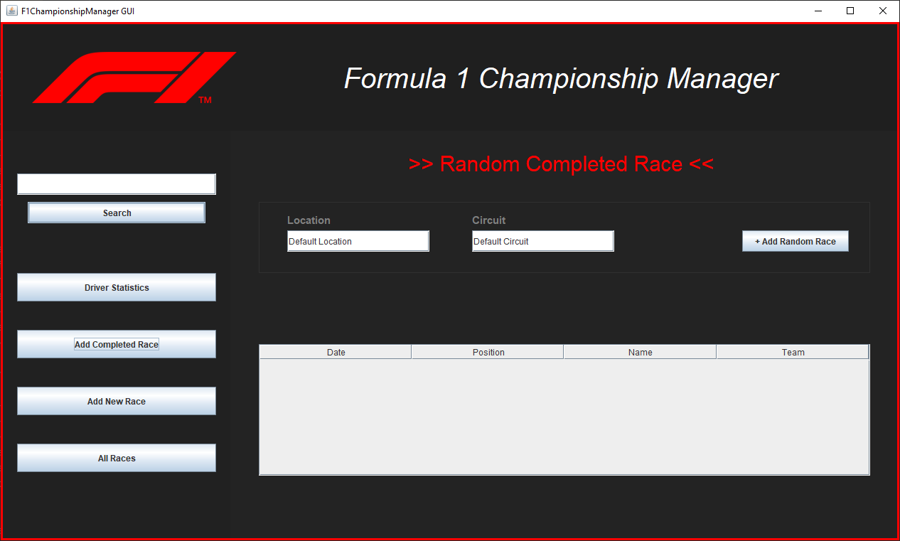
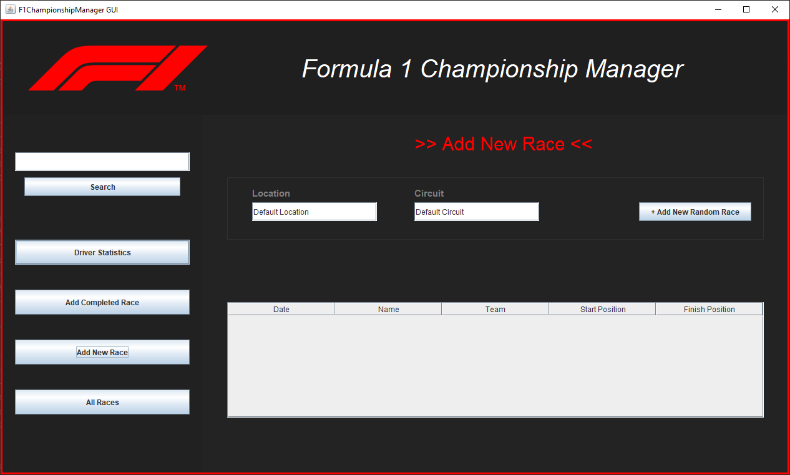
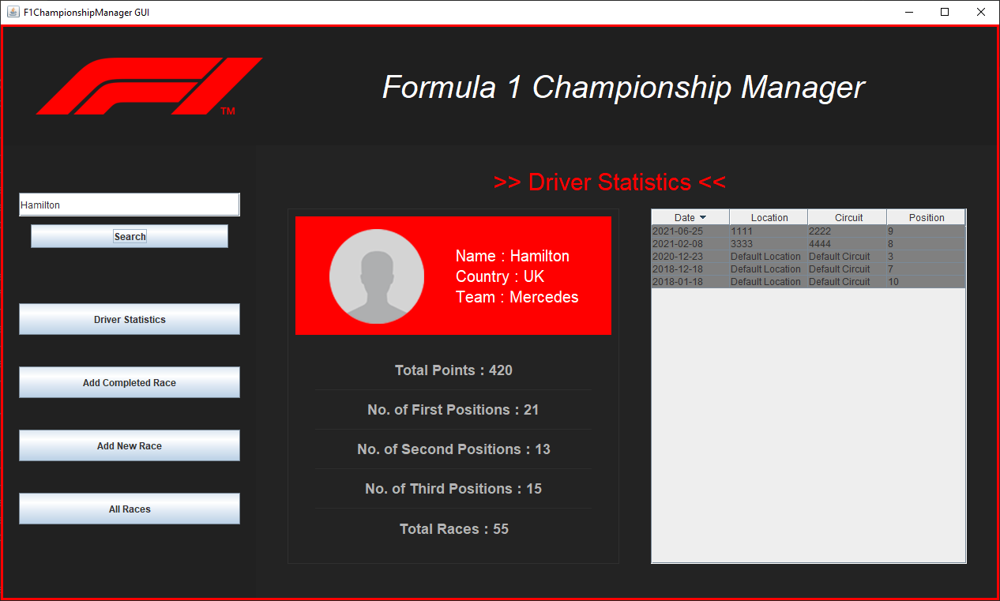

# Formula1_Championship_Manager
This whole application is developed in java using oop concepts. It also provides a Swing-based graphical user interface.

## Formula1 Championship Manager (GUI)

####Driver Statistics Screen

####Random Completed Race Screen

####Add New Race Screen

####All Completed Races Screen

####Search Screen

####Search Error(driver doesn't exist)
.PNG)

####Search Error(Enter something to search)
.PNG)

